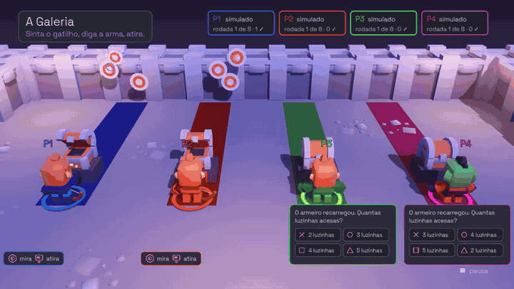

<p align="center">
  
</p>

<h1 align="center">Forja</h1>

<p align="center">
  <b>A game night for four friends, four DualSense controllers and one couch.</b><br>
  Nine rooms, a party match, a podium — and the controller doing everything it can do.
</p>

<p align="center"><a href="README.md">Português</a> · English</p>

---

## What a Forja night is like

Everyone grabs a DualSense and presses ✕. The controller lights up in your
seat's color, the little lights under the touchpad show who's who, and your
character steps onto a pedestal. Pick a look, get ready, and everyone walks
into the forge hall.

At the anvil in the middle, someone presses □ and picks the match: three
rooms, five or all nine, in order or shuffled, at a first-timer's pace or a
fast one. And off you go.

In each room, the character shows you what to do, and the first round is
**practice** — no points, just getting the feel. After three hits the screen
shouts **"For real!"**. Then it's hammering the rune before the ring closes,
balancing on the beam by tilting the controller, telling with your eyes
closed which weapon is in your trigger, raising the shield on the side the
blow shook, calling the crypt's guardian through the controller's microphone.

Between rooms, the scoreboard: points count up, rows swap, someone takes the
lead — sometimes a comeback. At the end the podium rises in blocks, confetti
falls, and the fanfare plays on the TV and on the winner's controller
speaker. Someone always wins.

## The nine rooms

| room | what you do |
| --- | --- |
| The Spark | press the rune's button before the ring closes, and hammer |
| The Beam | cross the lava tilting against the wind, aim at the bells by turning, break the stone with a shake |
| The Mold | the touchpad is the mold: trace, spread with two fingers, stamp with the click |
| The Impact | in the dark, the blow shakes one side of the controller: raise the shield on that side |
| The Gallery | the weapon comes in a closed chest; press R2 — pistol, machine gun or bow? |
| The Song | the anvil sings on one controller only, or on the TV: did it come from your hand? |
| The Paths | the ground only exists in your palm: grass, gravel, metal or water? |
| The Voice | the guardian listens through *your* controller's microphone: silence, call, mute |
| The Trial | Ember against Tide, ninety seconds with everything on at once |

## Play

1. Download a package from the [latest release](https://github.com/Hefesto-Team/Forja/releases)
   (or, until the first one is out, from the latest
   [CI run](https://github.com/Hefesto-Team/Forja/actions/workflows/forja.yml)):
   the **AppImage** or `.tar.gz` on Linux, the `.zip` on Windows — which also
   runs through Proton on Steam, with Steam Input turned off for the game.
2. Plug in the DualSense controllers — on the cable, preferably — and open the game.
3. ✕ to join, ✕ to get ready. Options pauses, and in the lobby △ opens your seat's options.

**So everyone plays well:** triggers can be weak or off and rumble goes from
0 to 100%, per player; camera shake and flashes turn off; text can grow; and
the screens speak Portuguese or English. Each player's color always comes
with their name (P1, P2…), and the colors were checked for color blindness.

## Why Forja exists

Forja was born to validate [Hefesto](https://github.com/Hefesto-Team/hefesto-dualsense4unix),
which brings the whole DualSense to Linux. While you play, each room notes
what it asked of each controller and what arrived, and gives a verdict per
feature — **passed**, **failed** or **not measured**, with the reason. The
game speaks DualSense the way Sony and Steam document it, never to Hefesto:
four controllers in four people's hands are the judge.

## For developers

```sh
./run-local.sh                       # builds, fetches Godot the first time, opens the game
./run-local.sh -- --simular=4 --robo # four fake controllers, and the robot plays
```

Everything is tested without hardware on every push. The build, the tests and
the code map are in [docs/DESENVOLVER.md](docs/DESENVOLVER.md) (in
Portuguese, like the rest of the documentation; the screens are translated).

## Credits

Made by **Hefesto Team**. Code under MIT ([LICENSE](LICENSE)); third-party
works and their notices in [LICENCAS-DE-TERCEIROS.md](LICENCAS-DE-TERCEIROS.md):
Kenney's 3D models and sound effects (CC0), Space Grotesk and JetBrains Mono
(OFL), SDL (zlib), Godot and godot-cpp (MIT). The music is synthesized by the
game itself. DualSense and PlayStation are trademarks of Sony Interactive
Entertainment; this project is not affiliated with Sony.
