<p align="center">
  
</p>

<h1 align="center">Forja</h1>

<p align="center">
  <b>Uma noite de jogo para quatro amigos, quatro DualSense e um sofá.</b><br>
  Nove salas, uma gincana, um pódio — e o controle fazendo tudo o que sabe fazer.
</p>

<p align="center">
  <a href="https://github.com/Hefesto-Team/Forja/actions/workflows/forja.yml"></a>
</p>

<p align="center">
  Português · <a href="README.en.md">English</a>
</p>

---

## Como é uma noite de Forja

Cada um pega um DualSense e aperta ✕. O controle acende na cor do seu lugar,
as luzinhas embaixo do touchpad mostram quem é quem, e o seu boneco sobe no
pedestal. Você escolhe o visual, fica pronto, e todo mundo entra no salão da
forja.

Na bigorna do meio, alguém aperta □ e escolhe a partida: três salas, cinco ou
as nove, na ordem ou sorteadas, no ritmo de quem joga pela primeira vez ou no
rápido. E começa.

Em cada sala, o boneco mostra o que fazer, e a primeira rodada é **treino** —
não vale ponto, é para pegar o jeito. Depois de três acertos, a tela grita
**"Valendo!"**. Aí é martelar a runa antes do anel fechar, equilibrar na viga
com o controle inclinado, descobrir de olhos fechados que arma está no seu
gatilho, levantar o escudo do lado em que o golpe tremeu, chamar o guardião da
cripta pelo microfone do controle.

Entre uma sala e outra, o placar: os pontos sobem contando, as posições
trocam, alguém passa a liderar — e às vezes a virada. No fim, o pódio sobe em
blocos, o confete cai, e a fanfarra toca na TV e no alto-falante do controle
de quem venceu. Sempre alguém vence.

<table>
  <tr>
    <td width="33%">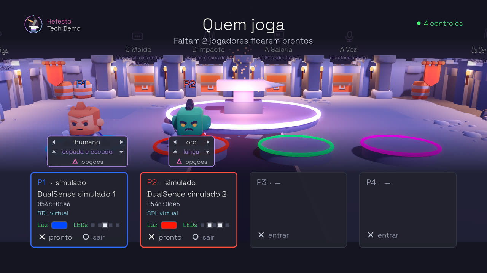</td>
    <td width="33%">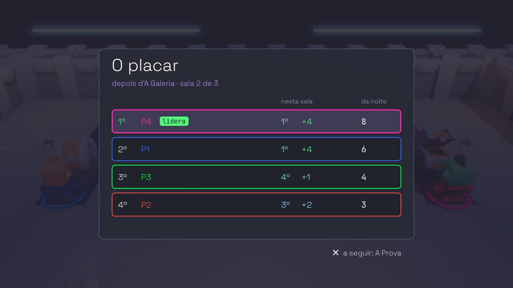</td>
    <td width="33%">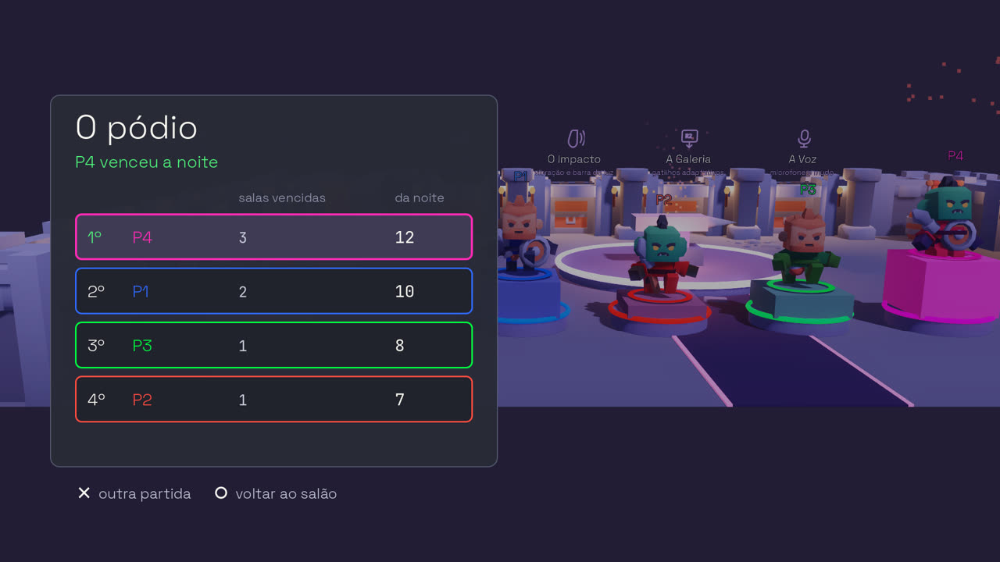</td>
  </tr>
  <tr>
    <td><b>Quem joga</b> — um controle, um lugar, uma cor. Até quatro, e a partir de um.</td>
    <td><b>O placar</b> — a colocação em cada sala vira pontos da noite.</td>
    <td><b>O pódio</b> — mais pontos; no empate, mais salas vencidas; e alguém sempre ganha.</td>
  </tr>
</table>

## As nove salas

Cada sala é um jogo curto que usa um pedaço do DualSense do jeito que os jogos
comerciais usam — e que você sente na mão antes de ver na tela.

<table>
  <tr>
    <td width="33%">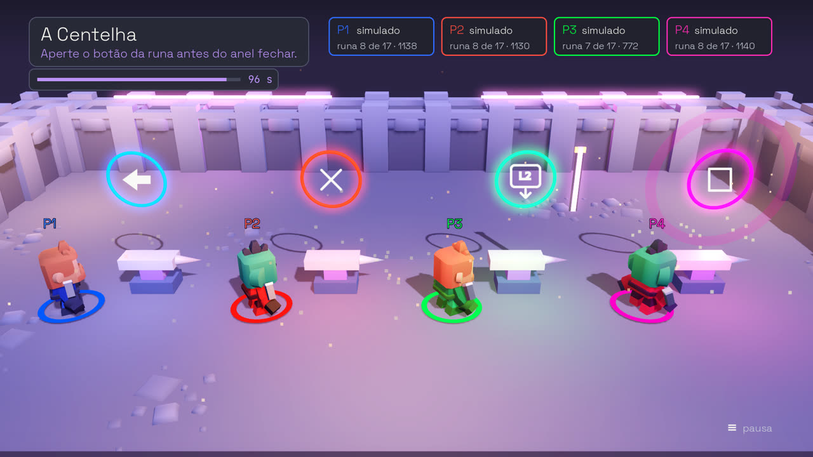</td>
    <td width="33%">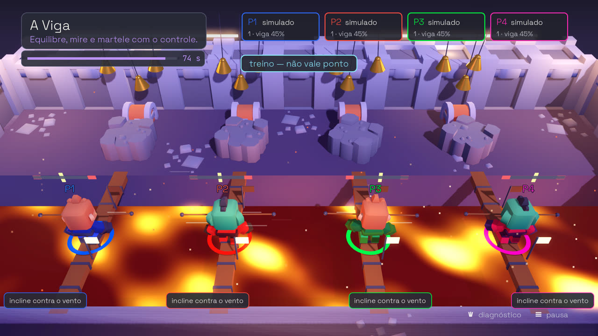</td>
    <td width="33%">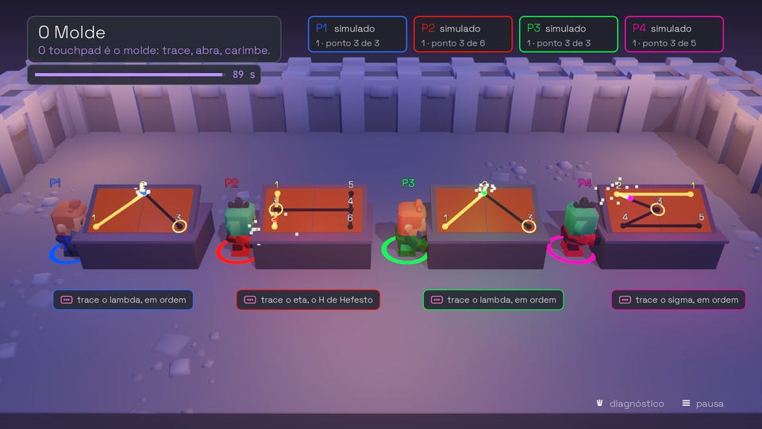</td>
  </tr>
  <tr>
    <td><b>A Centelha</b> — a runa acende em cima da sua bigorna: aperte o botão dela antes do anel fechar, e martele.</td>
    <td><b>A Viga</b> — atravesse a lava inclinando o controle contra o vento, mire nos sinos girando, quebre a pedra com uma sacudida.</td>
    <td><b>O Molde</b> — o touchpad é o molde: trace a letra, abra e feche com dois dedos, carimbe com o clique.</td>
  </tr>
  <tr>
    <td>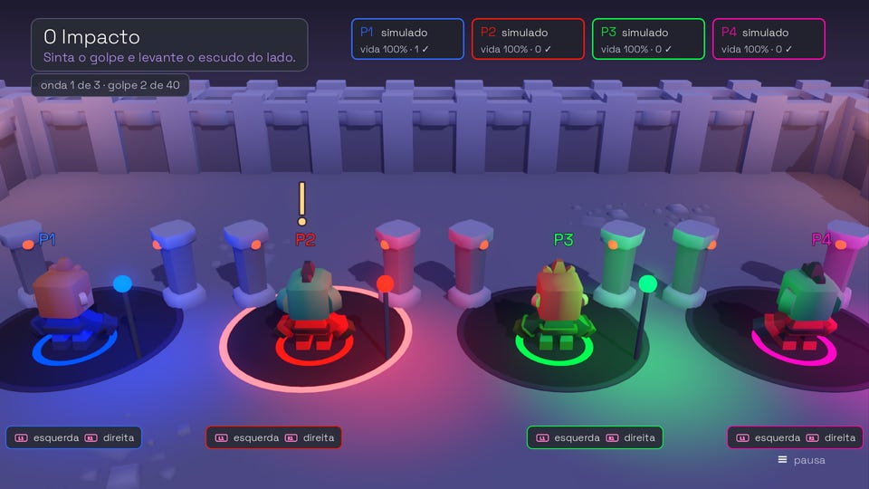</td>
    <td>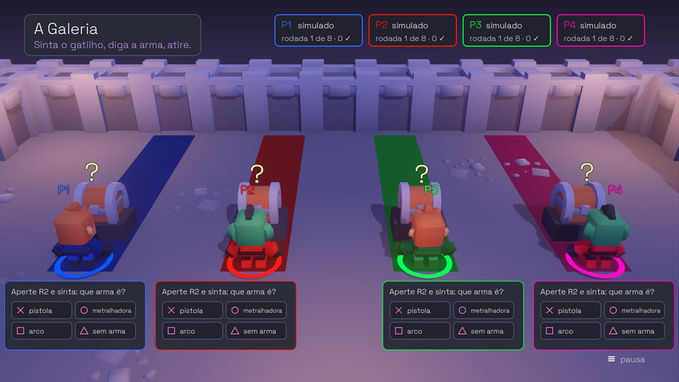</td>
    <td>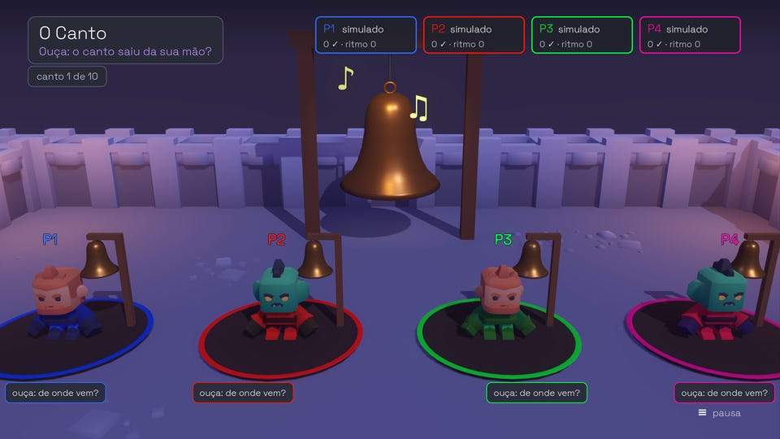</td>
  </tr>
  <tr>
    <td><b>O Impacto</b> — no escuro, o golpe treme só um lado do controle: levante o escudo daquele lado.</td>
    <td><b>A Galeria</b> — a arma chega num baú fechado. Aperte R2: é pistola, metralhadora ou arco? O gatilho responde.</td>
    <td><b>O Canto</b> — a bigorna canta num controle só, ou na TV. Saiu da sua mão? Então repita o ritmo.</td>
  </tr>
  <tr>
    <td>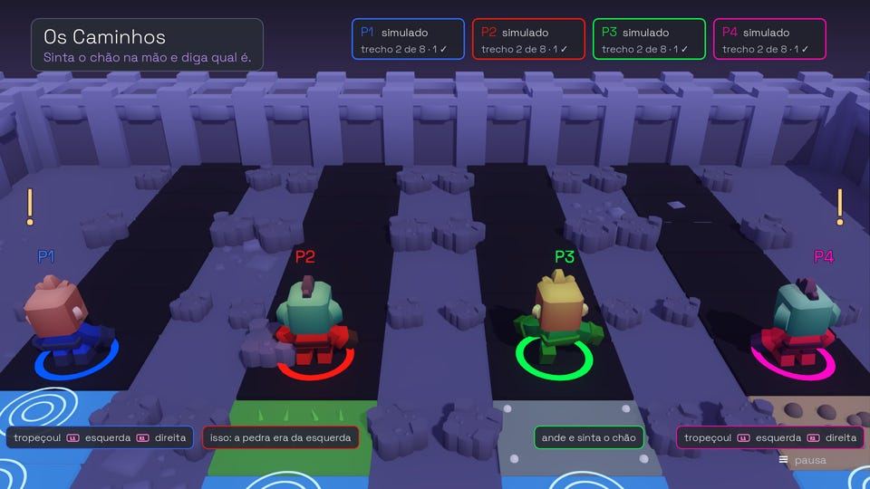</td>
    <td>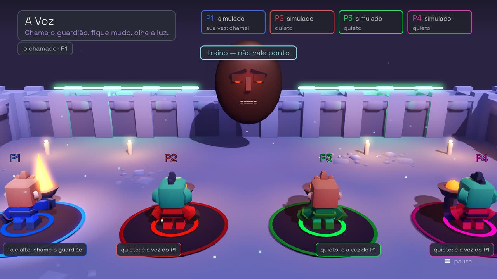</td>
    <td>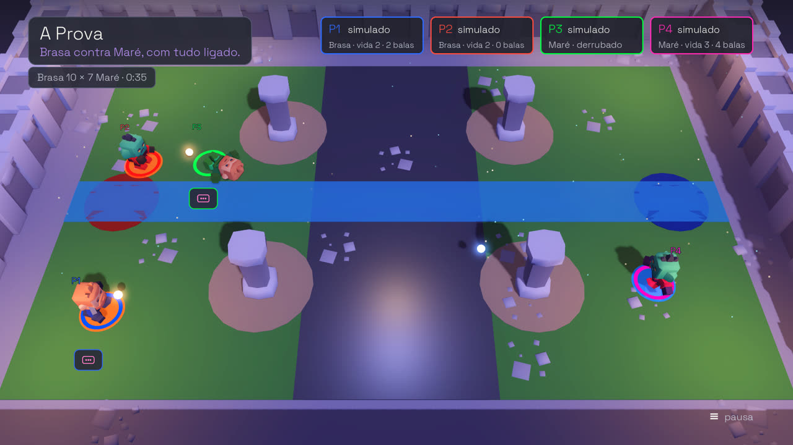</td>
  </tr>
  <tr>
    <td><b>Os Caminhos</b> — o chão só existe na palma da mão: grama, cascalho, metal ou água? E de que lado foi a pedra?</td>
    <td><b>A Voz</b> — o guardião da cripta escuta pelo microfone do <i>seu</i> controle. Silêncio. Chame. Fique mudo.</td>
    <td><b>A Prova</b> — Brasa contra Maré, noventa segundos com tudo ligado ao mesmo tempo.</td>
  </tr>
</table>

## Jogar

1. Baixe o pacote da [última versão](https://github.com/Hefesto-Team/Forja/releases)
   (ou, até sair a primeira, dos artefatos da última execução do
   [CI](https://github.com/Hefesto-Team/Forja/actions/workflows/forja.yml)):
   o **AppImage** ou o `.tar.gz` no Linux, o `.zip` no Windows — que também
   roda pelo Proton, na Steam, com o Steam Input desligado para o jogo.
2. Ligue os DualSense — no cabo, de preferência — e abra o jogo.
3. ✕ para entrar, ✕ para ficar pronto. Options pausa, e no lobby △ abre as
   opções do seu lugar.

Sem controle nenhum, o título oferece jogar no teclado. No Linux, para o jogo
ler o controle no cabo sem pedir root, a regra do udev que vem no pacote:

```sh
sudo cp 99-forja-dualsense.rules /etc/udev/rules.d/
sudo udevadm control --reload-rules && sudo udevadm trigger
```

**Para todo mundo jogar bem:** nas opções, o gatilho pode ficar fraco ou
desligado e a vibração vai de 0 a 100%, por jogador; o movimento da câmera e
os flashes se desligam; o texto pode crescer; e as telas falam português ou
inglês. A cor de cada jogador sempre vem com o nome dele (P1, P2…), e as
cores foram conferidas para quem enxerga diferente.

## Por que o Forja existe

O Forja nasceu para validar o [Hefesto](https://github.com/Hefesto-Team/hefesto-dualsense4unix),
que leva o DualSense inteiro para o Linux. O jeito mais honesto de saber se
um controle funciona é jogando: enquanto você joga, cada sala anota o que
pediu a cada controle e o que chegou, e no fim da sala dá o veredito por
recurso — **passou**, **falhou** (com o que foi medido) ou **não medido**
(com o porquê). O livro da sessão mostra tudo, e o relatório vai para o disco.

O jogo fala com o DualSense como a Sony e a Steam documentam, e nunca com o
Hefesto: quem estiver entre o jogo e o controle é invisível, e quatro
controles nas mãos de quatro pessoas são o juiz. A regra está no
[CONTRATO.md](CONTRATO.md); o roteiro de uma rodada de validação, em
[docs/VALIDAR.md](docs/VALIDAR.md).

## Para quem quer mexer

```sh
./run-local.sh                       # compila, baixa o Godot na primeira vez e abre o jogo
./run-local.sh -- --simular=4 --robo # quatro controles de mentira, e o robô joga
```

O jogo é Godot 4.4 com um módulo nativo em C (SDL3) que fala com os
controles. Tudo se prova sem aparelho: a cada push, o CI compila, joga as nove
salas com quatro controles simulados, tira o cabo de um deles no meio de cada
sala, liga vinte defeitos de mentira (e cada um tem de ser pego), exporta o
jogo e joga de novo no binário Linux, no AppImage e no `.exe` pelo Wine.

| se você quer… | leia |
| --- | --- |
| contribuir: as regras da casa e os comandos | [docs/COMO-CONTRIBUIR.md](docs/COMO-CONTRIBUIR.md) |
| compilar, exportar, rodar as provas | [docs/DESENVOLVER.md](docs/DESENVOLVER.md) |
| entender cada sala por dentro | [docs/SALAS.md](docs/SALAS.md) |
| saber onde o projeto está e o que falta | [SPRINTS.md](SPRINTS.md) |
| achar qualquer outro documento | [docs/README.md](docs/README.md) |

## Créditos

Feito pela **Hefesto Team**.

O código é MIT ([LICENSE](LICENSE)). O jogo usa obras de terceiros, cada uma
com o seu aviso em [LICENCAS-DE-TERCEIROS.md](LICENCAS-DE-TERCEIROS.md): os
modelos 3D e os efeitos sonoros da [Kenney](https://www.kenney.nl) (CC0), as
fontes Bungee, VT323, Archivo Narrow (OFL) e Permanent Marker (Apache), o [SDL](https://libsdl.org)
(zlib), o [Godot](https://godotengine.org) e o godot-cpp (MIT). A música é
sintetizada pelo próprio jogo. Nada vem do SDK da Sony.

DualSense e PlayStation são marcas da Sony Interactive Entertainment. Este
projeto não tem relação com a Sony.
