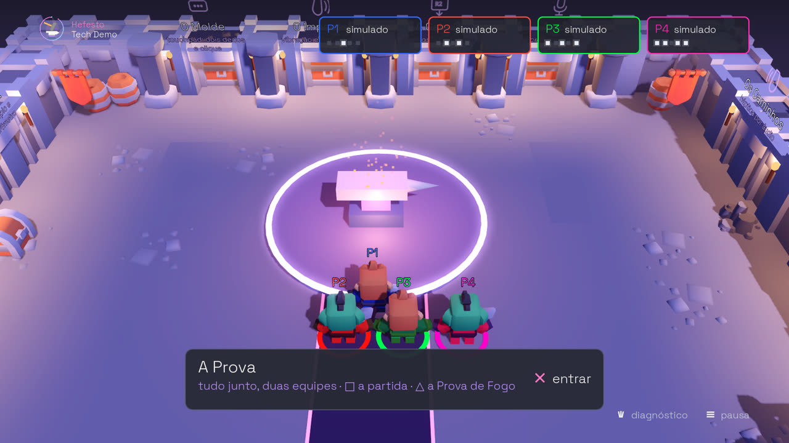
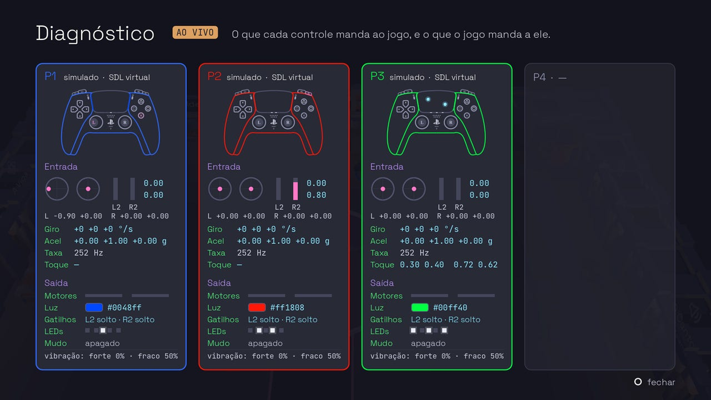
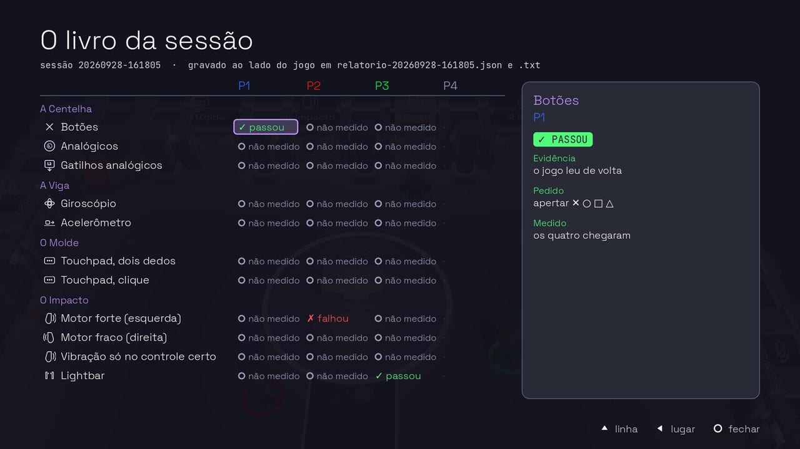

<p align="center">
  
</p>

<h1 align="center">Forja — a Hefesto Tech Demo</h1>

<p align="center">
  <b>Um jogo de festa local, em 3D, para até quatro DualSense —<br>
  que mede, enquanto se joga, o que chegou de cada controle.</b>
</p>

<p align="center">
  <a href="https://github.com/Hefesto-Team/Forja/actions/workflows/forja.yml"></a>
</p>

<p align="center">
  <a href="#baixar-e-jogar">Baixar e jogar</a> ·
  <a href="#as-salas">As salas</a> ·
  <a href="#validar-com-quatro-dualsense-passo-a-passo">Validar</a> ·
  <a href="#compilar-do-código">Compilar</a> ·
  <a href="#as-provas-sem-aparelho">As provas</a> ·
  <a href="#os-documentos">Os documentos</a>
</p>

---

## O que é

O Forja usa tudo o que o DualSense tem — botões, analógicos, gatilhos
adaptativos, giroscópio, acelerômetro, touchpad, os dois motores, a lightbar,
os LEDs de jogador, o alto-falante, a háptica dos atuadores e o microfone com
o botão de mudo — do jeito que os jogos comerciais usam, em nove salas que são
jogos curtos para quatro pessoas no mesmo sofá.

Enquanto se joga, cada sala mede o que chegou de cada controle e dá, por
jogador, um veredito para cada feature: **passou**, **falhou** (com o que foi
medido) ou **não medido** (com o porquê). No fim, o livro da sessão mostra a
tabela, e o relatório vai para o disco — o texto para ler, o JSON e a linha
do tempo para comparar.

É assim que o [Hefesto](https://github.com/Hefesto-Team/hefesto-dualsense4unix)
se valida: jogando. O jogo fala o DualSense como a Sony e a Steam documentam —
relatório USB `0x02`, os quatro modos oficiais de gatilho, player index 0..3 —
e nunca fala com o Hefesto. Quem estiver na frente do controle (o Hefesto, o
kernel, um cabo) é invisível; quatro controles na mão são o oráculo. A lei do
repositório é o [CONTRATO.md](CONTRATO.md).

<table>
  <tr>
    <td width="50%"></td>
    <td width="50%"></td>
  </tr>
  <tr>
    <td><b>O lobby</b> — cada um aperta ✕ e ganha o lugar P1…P4: a lightbar na cor do lugar, os LEDs de jogador no padrão do lugar e o boneco no pedestal. Cada um escolhe o visual antes de ficar pronto.</td>
    <td><b>O diagnóstico ao vivo</b> (Create) — o mapa de cada controle, com a peça apertada em rosa, o analógico andando, o dedo no touchpad, o motor e a barra de luz na cor mandada.</td>
  </tr>
</table>

O **salão da forja** é o hub: oito portões, um por sala, e a bigorna no meio —
✕ nela entra n'A Prova, □ escolhe uma **partida** (3, 5 ou as 9 salas, na
ordem ou sorteadas, com o placar entre elas e o pódio no fim), △ acende a
**Prova de Fogo** (as nove salas na ordem, sem voltar ao salão, e o livro no
fim). O **livro** (Options → O livro da
sessão) é o relatório na tela: feature × lugar, o pedido, o medido e o degrau
da evidência.

## As salas

<table>
  <tr>
    <td width="33%"></td>
    <td width="33%"></td>
    <td width="33%"></td>
  </tr>
  <tr>
    <td><b>A Centelha</b> — a runa acende em cima da bigorna de cada um; apertar a tempo martela. Botões, analógicos e gatilhos no meio e no fundo.</td>
    <td><b>A Viga</b> — a travessia sobre a lava (incline contra o vento), os sinos na mira do giroscópio, a pedra que quebra na sacudida.</td>
    <td><b>O Molde</b> — o molde é o touchpad: trace a letra, abra e feche com dois dedos, carimbe com o clique.</td>
  </tr>
  <tr>
    <td></td>
    <td></td>
    <td></td>
  </tr>
  <tr>
    <td><b>O Impacto</b>, às cegas — no escuro, o golpe treme só o motor do lado, e você levanta o escudo daquele lado; no fim, a cor da luz, olhando o controle.</td>
    <td><b>A Galeria</b>, às cegas — a arma chega no baú fechado e se reconhece pelo gatilho (parede e clique, tremor, peso, solto); a munição nas luzinhas.</td>
    <td><b>O Canto</b>, às cegas — a bigorna canta no alto-falante de UM controle ou na TV: saiu da sua mão? E o dono repete o ritmo.</td>
  </tr>
  <tr>
    <td></td>
    <td></td>
    <td></td>
  </tr>
  <tr>
    <td><b>Os Caminhos</b>, às cegas — o chão só existe nos atuadores (grama, cascalho, metal, água): diga o chão, e o lado da pedra no tropeço.</td>
    <td><b>A Voz</b> — o guardião da cripta escuta pelo microfone do SEU controle: o silêncio, a chamada na sua vez, o mudo e a luz dele, e o susto.</td>
    <td><b>A Prova</b> — a Brasa contra a Maré, noventa segundos com tudo ligado, e no fim as luzinhas e a cor às cegas.</td>
  </tr>
</table>

O desenho de cada sala, o que ela pede e o que ela mede: [docs/SALAS.md](docs/SALAS.md).

| sala | valida |
| --- | --- |
| A Centelha | botões, analógicos, gatilhos analógicos |
| A Viga | giroscópio, acelerômetro |
| O Molde | touchpad com dois dedos, clique |
| O Impacto | motor forte e fraco, isolamento entre controles, lightbar |
| A Galeria | gatilho em resistência, arma e vibração; LEDs de jogador |
| O Canto | alto-falante do controle |
| Os Caminhos | háptica por áudio (canais 3 e 4) |
| A Voz | microfone, mudo, LED do microfone |
| A Prova | tudo junto, com duas equipes |

## Baixar e jogar

Cada execução do CI (a aba **Actions**, o fluxo **FORJA**) deixa o jogo
exportado como artefato, pronto para rodar sem compilar nada:

- `forja-linux-x86_64` — dentro, `forja-linux-x86_64.tar.gz`: descompacte e
  rode `./forja.x86_64`;
- `forja-windows-x86_64` — dentro, `forja-windows-x86_64.zip`: descompacte e
  abra o `forja.exe` no Windows, ou pelo Proton no Linux ([abaixo](#rodar-o-exe-pelo-proton)).

Os arquivos de cada pasta andam juntos (o executável, o `forja.pck` e o módulo
nativo), e o `LEIA-ME.txt` de cada pacote traz os argumentos. Os relatórios
vão para `relatorios/`, ao lado do jogo.

**No controle:** ✕ entra e fica pronto, Create abre o diagnóstico, Options a
pausa. **Sem controle nenhum**, o título oferece jogar no teclado: o teclado
vira um DualSense simulado (o módulo inteiro roda, e o relatório diz que foi
simulado). WASD anda, Espaço é ✕, Backspace ○, Q □, E △, F é R2, G é L2, Tab
é Create, Esc é Options, M é o botão do microfone, e Z segurado é falar no
microfone do controle simulado; com `--simular=N`, Ctrl+1…4 troca o controle
que o teclado dirige.

Os argumentos do jogo vêm depois de `--`:

```sh
./forja.x86_64 -- --prova-de-fogo          # todas as salas, na ordem, e o livro no fim
./forja.x86_64 -- --partida=5 --sorteada   # uma partida de cinco salas sorteadas, e o pódio
./forja.x86_64 -- --sala=galeria           # direto numa sala, com todo controle dentro
./forja.x86_64 -- --semente=42             # o mesmo sorteio, para comparar sessões
./forja.x86_64 -- --simular=4 --robo       # sem controle: quatro de mentira, e o robô joga
./forja.x86_64 -- --experimento=quatro-mics  # a bancada do experimental/
./forja.x86_64 -- --relatorios=/uma/pasta
```

Para ler e escrever o hidraw do DualSense no cabo sem root (o report cru do
jack do fone, e as ferramentas de bancada), a regra do udev:

```sh
sudo cp udev/99-forja-dualsense.rules /etc/udev/rules.d/
sudo udevadm control --reload-rules && sudo udevadm trigger
```

### Rodar o .exe pelo Proton

O `.exe` é o do pacote `forja-windows-x86_64` (o artefato do CI, ou
`scripts/exportar.sh windows`). Descompacte a pasta inteira: o `forja.pck` e a
`libforja.windows.x86_64.dll` ficam ao lado do `forja.exe`.

1. Na Steam: **Jogos → Adicionar um jogo não-Steam à minha biblioteca… →
   Procurar…**, com o filtro em todos os arquivos, e escolha o `forja.exe`.
2. **Propriedades → Compatibilidade → Forçar o uso de uma ferramenta de
   compatibilidade específica do Steam Play**, e escolha um Proton.
3. **Propriedades → Controle**: desative o Steam Input para este jogo (com ele
   ligado, o jogo recebe um controle Xbox e perde o resto do DualSense).
4. Os argumentos entram em **Propriedades → Geral → Opções de inicialização**,
   depois de um `--` (por exemplo, `-- --semente=7`). Os relatórios ficam em
   `relatorios/`, ao lado do `.exe`.

A cada push, o CI roda esse mesmo `.exe` pelo Wine do Ubuntu, a base do
Proton: o robô joga a Prova de Fogo inteira com quatro DualSense simulados, e
o relatório tem de sair igual ao do binário Linux. O som de cada controle sob
Proton depende da versão dele: [docs/COMO-O-SOM-CHEGA-AO-CONTROLE.md](docs/COMO-O-SOM-CHEGA-AO-CONTROLE.md).

## Validar com quatro DualSense, passo a passo

Duas rodadas: os quatro controles **no cabo**, depois os quatro **no rádio**;
no fim, os dois relatórios lado a lado. Anote a versão do Hefesto e use a
mesma semente nas duas (`--semente=7`).

### No cabo

1. Ligue os quatro DualSense no USB e abra o jogo (`./run-local.sh -- --semente=7`).
2. No título, ✕. No lobby, cada um aperta ✕, na ordem P1…P4. Confira em cada
   controle: a lightbar na cor do cartão e os LEDs de jogador no padrão do
   lugar; no cartão, "USB", `054c:0ce6` e "DualSense nativo".
3. Cada um aperta ✕ de novo (pronto). No salão, Create abre o diagnóstico:
   mexa em tudo em cada controle — no mapa dele, a peça apertada acende em
   rosa, o analógico anda, o dedo no touchpad aparece, o giroscópio mostra a
   taxa. ○ fecha.
4. Jogue as salas que medem: A Centelha (as runas: todos os botões, os dois
   analógicos até a borda, os dois gatilhos no meio e no fundo), A Viga
   (incline o controle para equilibrar, gire para mirar nos sinos, sacuda para
   quebrar a pedra) e O Molde (trace a letra no touchpad, abra e feche com dois
   dedos, clique quando o metal brilhar). No fim de cada uma, o veredito de
   cada um na tela, por feature, com o que foi medido.
5. Jogue as salas às cegas, que perguntam o que a tela não mostra: O Impacto
   (sinta de que lado veio o golpe e levante o escudo daquele lado; no fim da
   onda, diga a cor da luz do seu controle) e A Galeria (aperte R2 e diga que
   arma é pelo gatilho; depois, conte as luzinhas embaixo do touchpad).
6. Jogue as salas de som. No aviso de cada uma, confira embaixo do seu nome o
   dispositivo que o jogo achou para você e como achou (pelo aparelho, pelo
   número, pelo nome): △ toca o teste nele (o sino no alto-falante; um pulso
   na esquerda e outro na direita, na háptica; no microfone, fale e a barra
   sobe), ◀ ▶ troca. O Canto (o canto saiu do seu controle? e repita o
   ritmo), Os Caminhos (sinta o chão e o lado da pedra, sem olhar a tela) e
   A Voz (silêncio; chame o guardião na sua vez; fique mudo pelo botão do
   microfone; diga como está a luz dele).
7. Na bigorna do meio do salão, ✕ entra n'A Prova: noventa segundos de partida
   com tudo ligado, e no fim diga as luzinhas e a cor do seu controle sem olhar
   a tela. Na mesma bigorna, △ acende a **Prova de Fogo**: todas as salas, na
   ordem do percurso, sem voltar ao salão, e o livro no fim
   (`./run-local.sh -- --prova-de-fogo` começa direto nela).
8. Options → O livro da sessão mostra a tabela. Os arquivos estão em
   `relatorios/`: `relatorio-<sessão>.txt` para ler, `.json` e a linha do tempo
   para comparar.

### No rádio

1. Pareie os quatro DualSense pelo Bluetooth, com o Hefesto rodando.
2. Abra o jogo com a mesma semente e repita os passos do cabo.
3. O cartão diz a origem que o jogo vê: com o Hefesto na frente, "DualSense
   Edge virtual" (ou "Xbox virtual", conforme o modo dele). Um DualSense
   nativo no rádio, sem ninguém na frente, entra só com a entrada, e o cartão
   diz isso ([ADR-005](docs/adr/005-o-radio-nativo-so-entrada.md)).

### Os dois relatórios

Ponha `relatorio-<cabo>.txt` e `relatorio-<rádio>.txt` lado a lado: cada
diferença é um trabalho para o Hefesto — a feature, o controle, o que foi
pedido e o que chegou.

<p align="center">
  
</p>

## Compilar do código

Godot 4.4 desenha; um módulo nativo com o SDL3 dentro fala com os controles
([ADR-007](docs/adr/007-o-jogo-e-o-3d-em-godot.md)). O módulo leva o SDL
3.4.14 (por versão **e** sha256) e o godot-cpp da série 4.4 (por tag **e**
commit) — nunca o que a distro tiver —, e os caminhos da máquina saem do
binário.

No Debian ou Ubuntu:

```sh
sudo apt install build-essential cmake ninja-build pkg-config git curl unzip \
  libasound2-dev libpulse-dev libpipewire-0.3-dev \
  libx11-dev libxext-dev libxrandr-dev libxcursor-dev libxfixes-dev libxi-dev libxss-dev libxtst-dev libxkbcommon-dev \
  libwayland-dev wayland-protocols libdecor-0-dev libdrm-dev libgbm-dev libgl1-mesa-dev libegl1-mesa-dev \
  libdbus-1-dev libudev-dev
sudo apt install mingw-w64          # só para o módulo do Windows
```

```sh
./run-local.sh                 # compila o módulo, baixa o Godot 4.4.1 na primeira vez, e abre o jogo
./run-local.sh -- --simular=4  # os argumentos do jogo depois de --

scripts/compilar.sh linux      # godot/bin/libforja.linux.x86_64.so
scripts/compilar.sh windows    # godot/bin/libforja.windows.x86_64.dll (mingw-w64, sem DLL do mingw)
scripts/compilar.sh testes     # as provas da lógica, sem SDL e sem Godot
scripts/compilar.sh tudo       # os três
```

Rodando do código, os relatórios vão para `relatorios/`, na raiz.

### Exportar o jogo

```sh
scripts/exportar.sh linux      # dist/forja-linux-x86_64/ e dist/forja-linux-x86_64.tar.gz
scripts/exportar.sh windows    # dist/forja-windows-x86_64/ e dist/forja-windows-x86_64.zip
scripts/exportar.sh tudo       # os dois
```

Cada pacote leva o executável, o `forja.pck`, o módulo nativo ao lado e um
`LEIA-ME.txt`; o do Linux leva também a regra do udev. O módulo da plataforma
tem de estar compilado antes. O Godot é o mesmo do `run-local.sh`, e os
modelos de exportação do Godot entram como o SDL, por versão e por sha256: só
os dois que o jogo usa (~60 MB, lidos por pedaços do pacote oficial de
1,2 GB), guardados em `.cache/`, sem tocar na pasta de dados do Godot da
máquina.

O CI faz tudo isso a cada push: compila os dois módulos, roda as provas,
exporta o jogo e deixa os módulos e os pacotes como artefatos.

## As provas sem aparelho

```sh
bash tests/prova_do_jogo.sh     # o jogo headless com quatro DualSense simulados
bash tests/prova_de_poucos.sh   # as nove salas com 1, 2 e 3 controles, e o microfone mudo
scripts/gauntlet.sh             # a mesma prova, e de novo com cada defeito de mentira: tem de falhar
bash tests/prova_da_bancada.sh  # os experimentos do experimental/, sem aparelho
make test                       # as ferramentas de bancada e o empacotador

scripts/exportar.sh tudo && bash tests/prova_da_exportacao.sh   # o jogo exportado, no Linux e pelo Wine
```

A prova do jogo confere, pelo que cada controle simulado **recebeu**, que o
player index, a luz, as lâmpadas, os modos de gatilho, o motor do lado do
golpe e o LED do mudo chegaram só no lugar certo — e que o relatório gravado
se lê, tem os quatro controles e não carrega endereço de aparelho nem caminho
da máquina. O gauntlet faz o mesmo com cada um dos 20 defeitos de mentira do
simulador (um botão trocado, um motor no vizinho, o som no controle errado, o
microfone surdo, a entrada que engasga…), e cada um tem de ser pego pela sala
certa, com o motivo certo.

A prova da exportação roda o jogo exportado, sem o editor: o robô joga a
Prova de Fogo inteira no binário Linux e no `.exe` pelo Wine; os dois fecham
sozinhos no fim (`--sair-no-fim`), gravam o relatório dos quatro lugares sem
nenhum "falhou", e têm de medir a mesma matriz.

<p align="center">
  
</p>

A bancada do `experimental/` (`--experimento=ID`) roda dentro do jogo: o laço
do alto-falante ao microfone, os quatro microfones, o eco, o gatilho pelo
report cru e a háptica pelo nome. O que precisa de aparelho diz que não mediu,
com o porquê; o que o simulador alcança, mede.

## O que tem aqui

| caminho | o que é |
| --- | --- |
| `godot/` | o jogo: cenas, scripts (`scripts/`: o salão, os jogadores, as salas, a interface), a arte e as provas headless (`testes/`) |
| `nativo/` | o módulo nativo: `nucleo/` (relatório, vereditos, origem do controle, simulador, linha do tempo — C), `som/` (o som de cada controle), `godot/` (a GDExtension, C++), `testes/` (as provas da lógica) |
| `include/`, `src/` | o empacotador USB `0x02` compartilhado, e as ferramentas de bancada `forja-send`, `forja-speak`, `forja-read` |
| `scripts/` | `compilar.sh` (o build reproduzível do módulo), `exportar.sh` (o jogo exportado), `gauntlet.sh` (a prova com defeitos de mentira), `mapa_do_controle.js` (as camadas do mapa, dos SVGs do app) |
| `tests/` | a prova do jogo, a da bancada, a da exportação e a do som |
| `experimental/` | a bancada dos experimentos e os resultados anotados |
| `docs/` | as salas, o som, as decisões ([docs/adr](docs/adr/README.md)) e os estudos ([docs/estudos](docs/estudos/README.md)) |
| `udev/` | a regra para ler e escrever o hidraw sem root |

## Os documentos

| documento | o que diz |
| --- | --- |
| [CONTRATO.md](CONTRATO.md) | a lei: o que o jogo fala com o controle, e o que nunca fala |
| [AGENTS.md](AGENTS.md) | as regras da casa e os comandos, para quem mexe no código |
| [docs/SALAS.md](docs/SALAS.md) | o desenho de cada sala: o que ela pede, o que mede, o veredito |
| [docs/COMO-O-SOM-CHEGA-AO-CONTROLE.md](docs/COMO-O-SOM-CHEGA-AO-CONTROLE.md) | o alto-falante, a háptica e o microfone de cada controle, no Linux, no Windows e sob o Proton |
| [docs/adr](docs/adr/README.md) | as decisões, uma por arquivo |
| [docs/estudos](docs/estudos/README.md) | os estudos que guiaram a cara e o método: o Hefesto por dentro, os manuais de UI e UX, o sistema visual do app Hefesto, o DualSense nos jogos comerciais |
| [SPRINTS.md](SPRINTS.md) | o plano, onde cada marco chegou, e o que falta para um jogo completo |
| [COMO-RODAR.md](COMO-RODAR.md) | as ferramentas de bancada |
| [experimental/](experimental/README.md) | a bancada dos experimentos e os resultados |

## Licença e créditos

O código é MIT ([LICENSE](LICENSE)). Os modelos 3D são do Mini Dungeon da
[Kenney](https://www.kenney.nl) (CC0); as fontes, Space Grotesk e JetBrains
Mono (SIL OFL 1.1); o desenho do DualSense, o mapa do controle, os glifos e o
logo vêm do app Hefesto (MIT) — a origem de cada arquivo está em
[godot/assets/LEIA-ME.md](godot/assets/LEIA-ME.md). O módulo leva o
[SDL](https://libsdl.org) (zlib) e o godot-cpp (MIT); o jogo roda no
[Godot](https://godotengine.org) (MIT). Nada vem do SDK da Sony.

DualSense e PlayStation são marcas da Sony Interactive Entertainment. Este
projeto não tem relação com a Sony.
