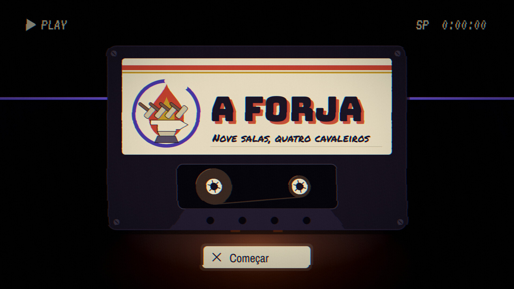
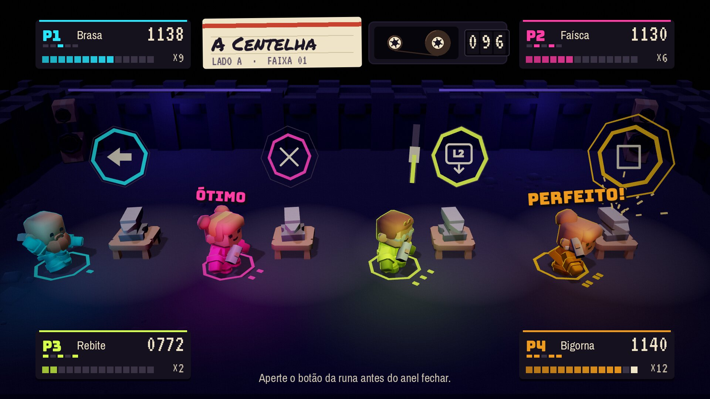
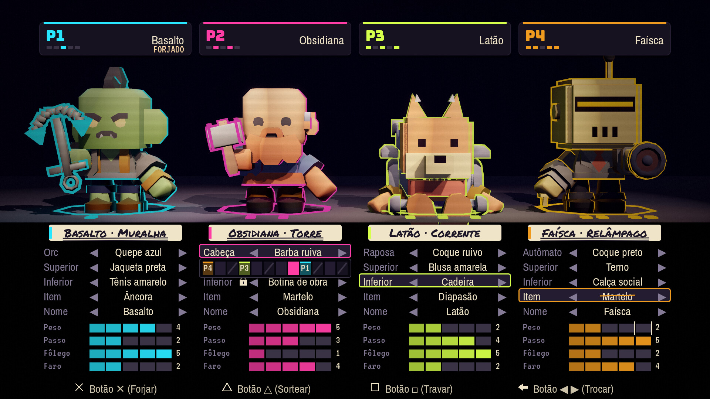
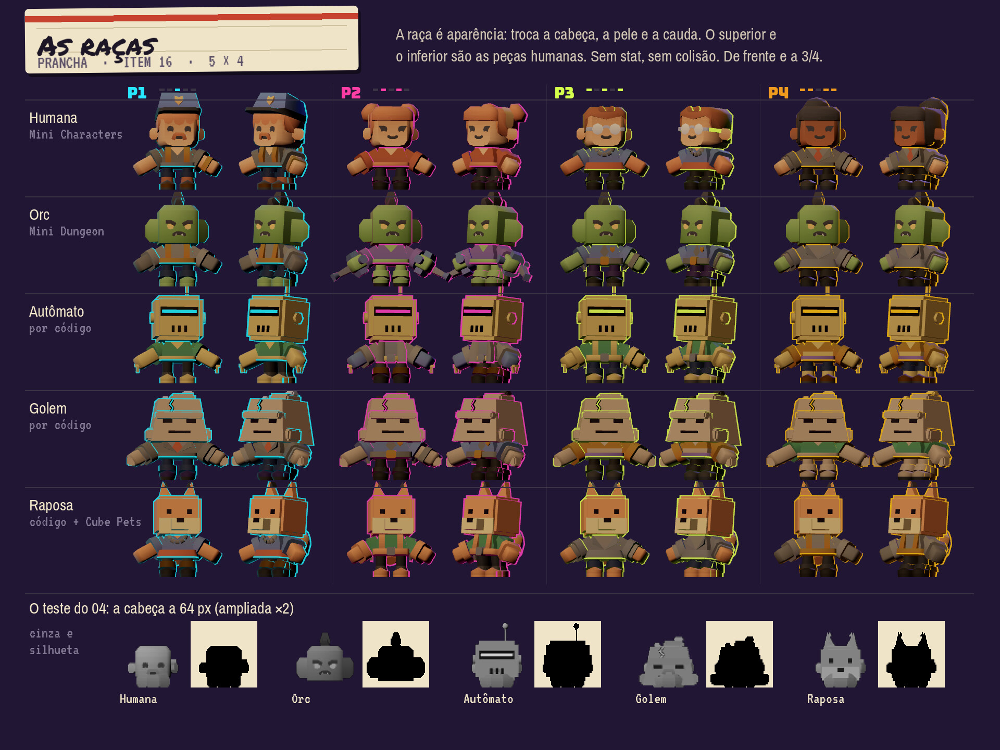
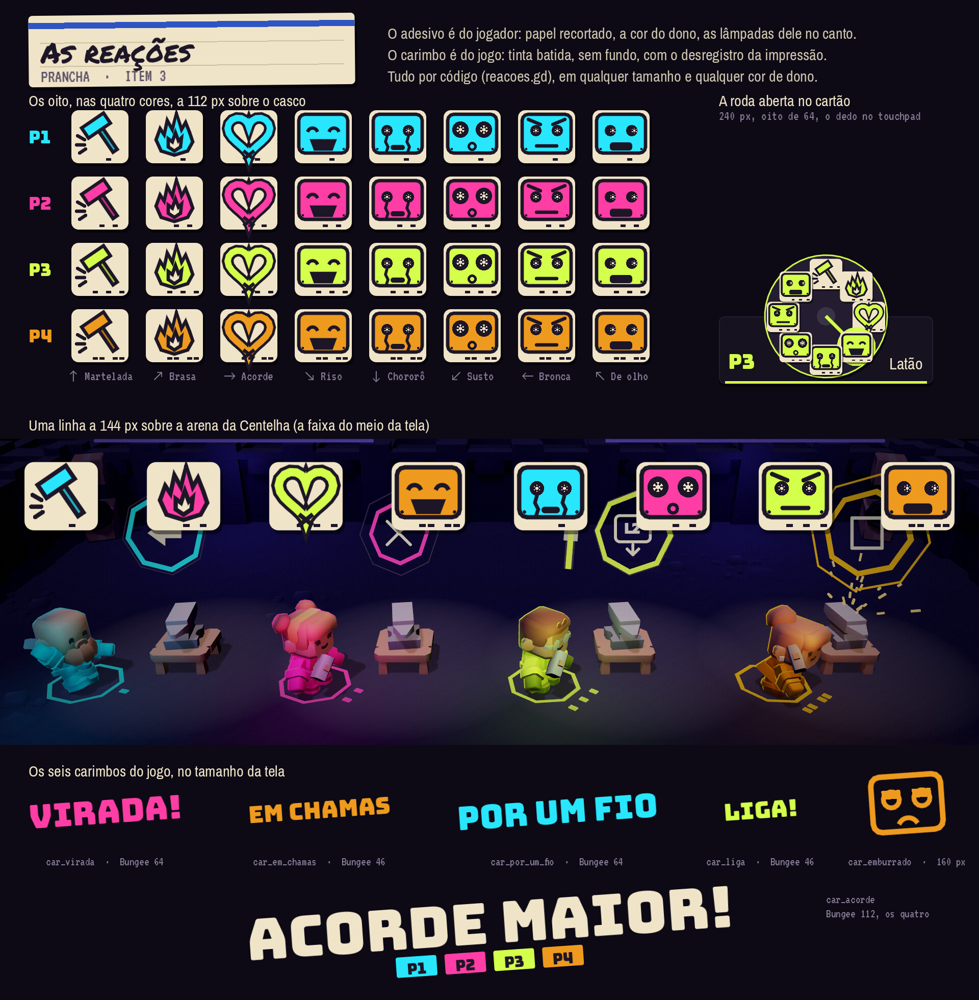
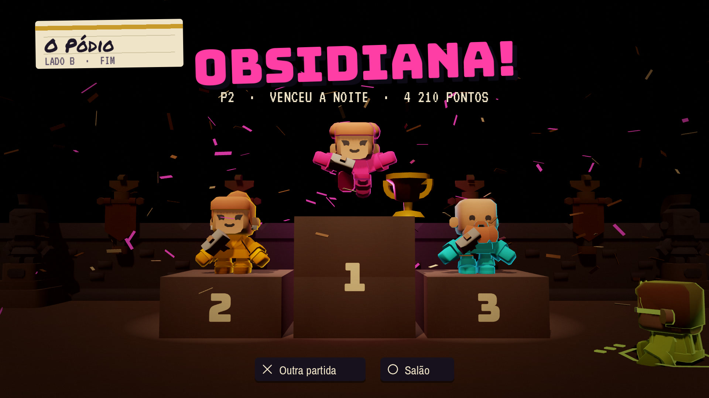

<p align="center">
  
</p>

<h1 align="center">A Forja</h1>

<p align="center">
  <b>Uma noite de jogo para quatro amigos, quatro DualSense e um sofá.</b><br>
  45 minigames em nove seções, uma fita gravada a quatro mãos, e o controle fazendo tudo o que sabe fazer.
</p>

<p align="center">
  <a href="https://github.com/Hefesto-Team/Forja/actions/workflows/forja.yml"></a>
</p>

---

## A noite é uma fita

Quatro amigos gravam uma fita. Cada minigame é uma faixa, a noite tem lado A
(o corpo: a mão, o equilíbrio, o toque, o golpe, a mira) e lado B (o espírito:
o ouvido, o chão que se sente, a voz, e tudo junto no fim). O contador do deck
anda de verdade, a etiqueta é escrita à mão, e quando a fita enrosca a imagem
desregistra e o som desafina: é a Dissonância, o vilão.

Os jogadores são os Cavaleiros de Néon. Cada armadura soa uma nota só, e as
quatro juntas fazem o acorde da Forja. Ninguém toca a música inteira sozinho.

<p align="center">
  
</p>

## A direção de arte

A bíblia inteira está em [docs/jogo/arte/](docs/jogo/arte/README.md), e a
[página da direção](docs/jogo/direcao-de-arte.html) mostra os quadros. Todos
são renderizados pelo próprio Godot, com modelos da Kenney, a partir do estudo
em `godot/estudos/direcao/`.

<table>
  <tr>
    <td width="50%"></td>
    <td width="50%"></td>
  </tr>
  <tr>
    <td><b>A montagem</b>: cabeça, tronco, pernas e item, cada um com o seu material. O néon do jogador é só o acento.</td>
    <td><b>As raças</b>: humana, orc, autômato de latão, golem de escória e raposa ferreira. Só aparência, sem status.</td>
  </tr>
  <tr>
    <td></td>
    <td></td>
  </tr>
  <tr>
    <td><b>As reações</b>: cada cavaleiro diz o que sente, sem uma palavra.</td>
    <td><b>O pódio</b>: no fim da fita, alguém sempre vence.</td>
  </tr>
</table>

O [storyboard da noite](docs/imagens/direcao/14_storyboard.jpg) vai do título
ao fim da fita em 18 planos.

| a bíblia | o que decide |
| --- | --- |
| [cinema](docs/jogo/arte/01-cinema.md), [cor e letra](docs/jogo/arte/02-cor-e-letra.md), [movimento](docs/jogo/arte/05-movimento.md) | a câmera, a luz, a paleta, as fontes, o tempo de cada gesto |
| [som](docs/jogo/arte/03-som.md) e [o mapa do áudio](docs/jogo/audio/mapa.csv) | a voz de cada cavaleiro e os 258 sons do jogo, cada um com a sua receita |
| [o cavaleiro](docs/jogo/arte/04-o-cavaleiro.md) e [o RPG](docs/jogo/sistemas/README.md) | as peças, as raças e o que cada escolha muda no jogo |
| [a diversão](docs/jogo/diversao/README.md) | o momento de grito de cada minigame, e como se confere |
| [o DualSense](docs/jogo/pesquisa/dualsense.md) | o que o controle sabe fazer, e qual minigame usa o quê |
| [acessibilidade](docs/jogo/arte/10-acessibilidade.md) e [o que nunca](docs/jogo/arte/11-o-que-nunca.md) | daltonismo, flashes, conforto, e o que não entra |

## Onde o projeto está

As nove salas de hoje funcionam e cada uma prova um recurso do DualSense. O
caminho até os 45 minigames e a direção nova está no
[quadro](docs/jogo/tarefas/README.md), ficha por ficha, e o porquê de cada
decisão em [docs/jogo/](docs/jogo/README.md).

A Forja também valida o [Hefesto](https://github.com/Hefesto-Team/hefesto-dualsense4unix),
que leva o DualSense inteiro para o Linux: enquanto você joga, o registro
anota o que cada sala pediu ao controle e o que chegou. O jogo fala com o
DualSense como a Sony e a Steam documentam, nunca com o Hefesto
([CONTRATO.md](CONTRATO.md)).

## Jogar e mexer

```sh
./run-local.sh                       # compila, baixa o Godot na primeira vez e abre o jogo
./run-local.sh -- --simular=4 --robo # quatro controles de mentira, e o robô joga
```

Godot 4.7.2 com um módulo nativo em C (SDL3) que fala com os controles. Tudo
se prova sem aparelho: o CI compila, joga as salas com quatro controles
simulados, tira o cabo de um deles no meio, liga defeitos de mentira (e cada
um tem de ser pego) e joga de novo no binário exportado. Os pacotes saem nos
artefatos do [CI](https://github.com/Hefesto-Team/Forja/actions/workflows/forja.yml).

| se você quer… | leia |
| --- | --- |
| contribuir | [docs/COMO-CONTRIBUIR.md](docs/COMO-CONTRIBUIR.md) |
| compilar, exportar, rodar as provas | [docs/DESENVOLVER.md](docs/DESENVOLVER.md) |
| achar qualquer outro documento | [docs/README.md](docs/README.md) |

## Créditos

Feito pela **Hefesto Team**. O código é MIT ([LICENSE](LICENSE)). As obras de
terceiros, cada uma com o seu aviso, estão em
[LICENCAS-DE-TERCEIROS.md](LICENCAS-DE-TERCEIROS.md): os modelos 3D e os
efeitos da [Kenney](https://www.kenney.nl) (CC0), as fontes (OFL e Apache), o
[SDL](https://libsdl.org) (zlib), o [Godot](https://godotengine.org) e o
godot-cpp (MIT). Nada vem do SDK da Sony.

DualSense e PlayStation são marcas da Sony Interactive Entertainment. Este
projeto não tem relação com a Sony.
