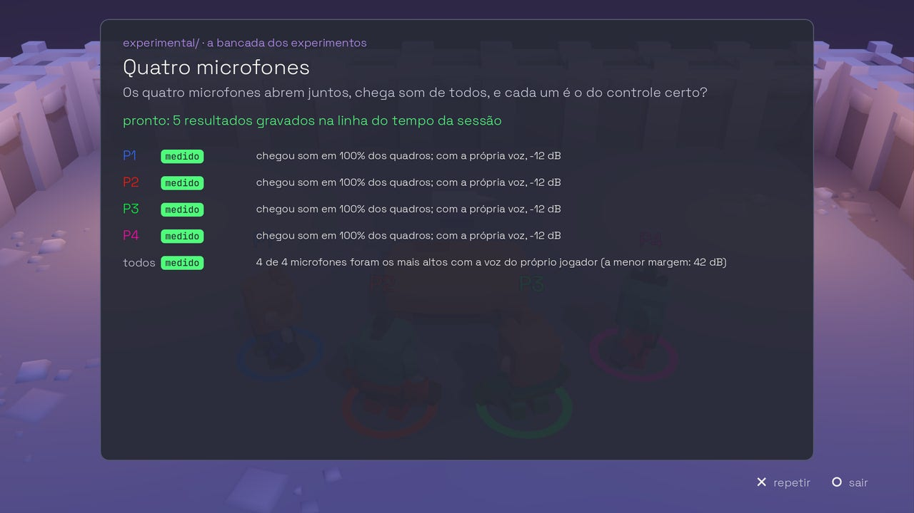

# Desenvolver o Forja

Para quem vai mexer no código. Antes de qualquer patch, a lei:
[CONTRATO.md](../CONTRATO.md) (o que o jogo fala com o controle, e o que
nunca fala) e [AGENTS.md](../AGENTS.md) (as regras da casa e os comandos).

O jogo é o 3D em Godot 4.4; um módulo nativo em C, com o SDL3 dentro, fala
com os controles ([ADR-007](adr/007-o-jogo-e-o-3d-em-godot.md)).

## Compilar

Godot 4.4 desenha; um módulo nativo com o SDL3 dentro fala com os controles
([ADR-007](adr/007-o-jogo-e-o-3d-em-godot.md)). O módulo leva o SDL
3.4.14 (por versão **e** sha256) e o godot-cpp da série 4.4 (por tag **e**
commit) — nunca o que a distro tiver —, e os caminhos da máquina saem do
binário.

No Debian ou Ubuntu:

```sh
sudo apt install build-essential cmake ninja-build pkg-config git curl unzip \
  libasound2-dev libpulse-dev libpipewire-0.3-dev \
  libx11-dev libxext-dev libxrandr-dev libxcursor-dev libxfixes-dev libxi-dev libxss-dev libxtst-dev libxkbcommon-dev \
  libwayland-dev wayland-protocols libdecor-0-dev libdrm-dev libgbm-dev libgl1-mesa-dev libegl1-mesa-dev \
  libdbus-1-dev libudev-dev
sudo apt install mingw-w64          # só para o módulo do Windows
```

```sh
./run-local.sh                 # compila o módulo, baixa o Godot 4.4.1 na primeira vez, e abre o jogo
./run-local.sh -- --simular=4  # os argumentos do jogo depois de --

scripts/compilar.sh linux      # godot/bin/libforja.linux.x86_64.so
scripts/compilar.sh windows    # godot/bin/libforja.windows.x86_64.dll (mingw-w64, sem DLL do mingw)
scripts/compilar.sh testes     # as provas da lógica, sem SDL e sem Godot
scripts/compilar.sh tudo       # os três
```

Rodando do código, os relatórios vão para `relatorios/`, na raiz.

### Exportar o jogo

```sh
scripts/exportar.sh linux      # dist/forja-linux-x86_64/ e dist/forja-linux-x86_64.tar.gz
scripts/exportar.sh windows    # dist/forja-windows-x86_64/ e dist/forja-windows-x86_64.zip
scripts/exportar.sh tudo       # os dois
scripts/exportar.sh appimage   # dist/FORJA-x86_64.AppImage, a partir do linux
```

Cada pacote leva o executável, o `forja.pck`, o módulo nativo ao lado, um
`LEIA-ME.txt` e o `LICENCAS.txt` (os avisos de terceiros); o do Linux leva
também a regra do udev, o ícone e o `forja.desktop`; o `.exe` sai com o ícone
(`scripts/forja.ico`) e a versão do projeto, gravados pelo
`scripts/icone_do_exe.py` depois da exportação — o Godot 4.4 pediria o rcedit
pelo Wine. A cada tag, o CI publica
os três pacotes como release no GitHub. O módulo da plataforma
tem de estar compilado antes. O Godot é o mesmo do `run-local.sh`, e os
modelos de exportação do Godot entram como o SDL, por versão e por sha256: só
os dois que o jogo usa (~60 MB, lidos por pedaços do pacote oficial de
1,2 GB), guardados em `.cache/`, sem tocar na pasta de dados do Godot da
máquina.

O CI faz tudo isso a cada push: compila os dois módulos, roda as provas,
exporta o jogo e deixa os módulos e os pacotes como artefatos.


## Os argumentos do jogo

Depois de `--`, na linha de comando (e em **Opções de inicialização**, na Steam):

```sh
./forja.x86_64 -- --prova-de-fogo          # todas as salas, na ordem, e o livro no fim
./forja.x86_64 -- --partida=5 --sorteada   # uma partida de cinco salas sorteadas, e o pódio
./forja.x86_64 -- --nivel=0                # o ritmo: 0 primeira vez, 1 normal, 2 rápido
./forja.x86_64 -- --sala=galeria           # direto numa sala, com todo controle dentro
./forja.x86_64 -- --semente=42             # o mesmo sorteio, para comparar sessões
./forja.x86_64 -- --simular=4 --robo       # sem controle: quatro de mentira, e o robô joga
./forja.x86_64 -- --experimento=quatro-mics  # a bancada do experimental/
./forja.x86_64 -- --relatorios=/uma/pasta
```

Para ler e escrever o hidraw do DualSense no cabo sem root (o report cru do
jack do fone, e as ferramentas de bancada), a regra do udev:

```sh
sudo cp udev/99-forja-dualsense.rules /etc/udev/rules.d/
sudo udevadm control --reload-rules && sudo udevadm trigger
```


## As provas sem aparelho

```sh
bash tests/prova_do_jogo.sh     # o jogo headless com quatro DualSense simulados
bash tests/prova_de_poucos.sh   # as nove salas com 1, 2 e 3 controles, e o microfone mudo
scripts/gauntlet.sh             # a mesma prova, e de novo com cada defeito de mentira: tem de falhar
bash tests/prova_da_bancada.sh  # os experimentos do experimental/, sem aparelho
make test                       # as ferramentas de bancada e o empacotador

scripts/exportar.sh tudo && bash tests/prova_da_exportacao.sh   # o jogo exportado, no Linux e pelo Wine
```

A prova do jogo confere, pelo que cada controle simulado **recebeu**, que o
player index, a luz, as lâmpadas, os modos de gatilho, o motor do lado do
golpe e o LED do mudo chegaram só no lugar certo — e que o relatório gravado
se lê, tem os quatro controles e não carrega endereço de aparelho nem caminho
da máquina. O gauntlet faz o mesmo com cada um dos 20 defeitos de mentira do
simulador (um botão trocado, um motor no vizinho, o som no controle errado, o
microfone surdo, a entrada que engasga…), e cada um tem de ser pego pela sala
certa, com o motivo certo.

A prova da exportação roda o jogo exportado, sem o editor: o robô joga a
Prova de Fogo inteira no binário Linux e no `.exe` pelo Wine; os dois fecham
sozinhos no fim (`--sair-no-fim`), gravam o relatório dos quatro lugares sem
nenhum "falhou", e têm de medir a mesma matriz.

<p align="center">
  
</p>

A bancada do `experimental/` (`--experimento=ID`) roda dentro do jogo: o laço
do alto-falante ao microfone, os quatro microfones, o eco, o gatilho pelo
report cru e a háptica pelo nome. O que precisa de aparelho diz que não mediu,
com o porquê; o que o simulador alcança, mede.


## As fotos e o trailer

```sh
bash tests/telas.sh fotos pasta/        # nove telas, pelo roteiro de godot/testes/captura_jogo.gd
bash tests/telas.sh comparar antes/ depois/ saida/   # a diferença de cada tela e as pranchas de daltonismo
FORJA_IDIOMA=en bash tests/telas.sh fotos pasta/     # as mesmas telas em inglês
scripts/trailer.sh                      # o trailer, gravado pelo Movie Maker do Godot (dist/trailer.avi)
```

O clarão d'A Voz tem medida própria (o estudo 02 pede menos de 20% da tela):
as fotos `voz_antes_do_susto` e `voz_clarao` saem do roteiro das salas com o
tremor desligado, e o `scripts/medir_clarao.gd` diz a área.

```sh
SAIDA=pasta ROTEIRO=salas SALAS=voz SEM_TREMOR=1 RAPIDO=1 xvfb-run -a -s "-screen 0 1920x1080x24" \
  tools/Godot_v4.4.1-stable_linux.x86_64 --rendering-driver opengl3 --fixed-fps 60 --path godot \
  --resolution 1920x1080 res://testes/captura_jogo.tscn -- --simular=4 --robo --semente=7
tools/Godot_v4.4.1-stable_linux.x86_64 --headless -s scripts/medir_clarao.gd -- \
  pasta/voz_antes_do_susto.png pasta/voz_clarao.png 20
```

## O mapa do código

| caminho | o que é |
| --- | --- |
| `godot/` | o jogo: cenas, scripts (`scripts/`: o salão, os jogadores, as salas, a interface), a arte e as provas headless (`testes/`) |
| `nativo/` | o módulo nativo: `nucleo/` (relatório, vereditos, origem do controle, simulador, linha do tempo — C), `som/` (o som de cada controle), `godot/` (a GDExtension, C++), `testes/` (as provas da lógica) |
| `include/`, `src/` | o empacotador USB `0x02` compartilhado, e as ferramentas de bancada `forja-send`, `forja-speak`, `forja-read` |
| `scripts/` | `compilar.sh` (o build reproduzível do módulo), `exportar.sh` (o jogo exportado), `gauntlet.sh` (a prova com defeitos de mentira), `mapa_do_controle.js` (as camadas do mapa, dos SVGs do app) |
| `tests/` | a prova do jogo, a da bancada, a da exportação e a do som |
| `experimental/` | a bancada dos experimentos e os resultados anotados |
| `docs/` | as salas, o som, as decisões ([docs/adr](adr/README.md)) e os estudos ([docs/estudos](estudos/README.md)) |
| `udev/` | a regra para ler e escrever o hidraw sem root |

